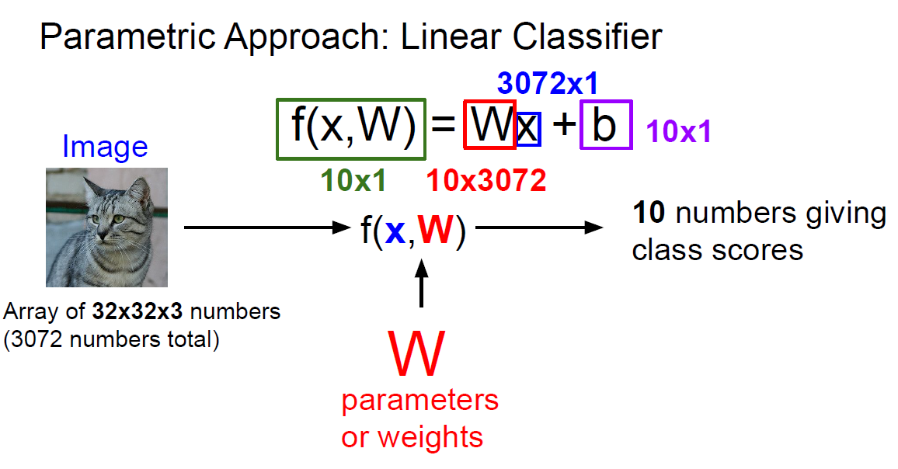

CS231n 2주차
============

**1. Today..**
-----
--------------------------

   - The Image Classification Task
   - Nearest Neighbor Classifier
   - K-Nearest Neighbor
   - Liner Classifier


**2. 강의 요약**
-----
-------------------
**1) The Image Classification Task**


 Image Classification이란?
  >  이미지가 input되면 이미 정해져있는 Categories 중 어느 Catagory에 속하게 되는지 고르는 문제

Image Classification이 가능하면 Image Detection/ Segmentation/Captioning도 가능해진다.

하지만 Image Classification에는 여러 문제점이 존재한다.

>1. Semantic Gap : 컴퓨터는 사진을 숫자들의 배열로 보기 때문
>2. Viewpoint variation : 보이는 시각에 따라 이미지가 다르게 보인다.
>3. Background Clutter : 배경과 구분이 안가는 경우
>4. Illumination : 조명에 따른 변화
>5. Occlusion : 객체가 가려져 있는 경우(은닉,은폐)
>6. Deformation : 형태가 다른 경우(객체 변형)
>7. Intraclass variation : 같은 class이지만 다른 객체인 경우

등과 같은 문제가 존재한다.

---------
**Data-Driven Approach** (데이터 중심 접근방법)은 객체마다 직접 코딩을 하여 분류하지 않고 방대한 양의 데이터를 수집하여 접근하는 방식을 말한다.

간략하게 말하자면

>1. Collect a dataset 
>2. Training
>3. Evaluate

의 과정으로 말할 수 있다.      

----------------

   **2) Nearest Neighbor Classifier**

이 분류기는 잘 쓰지 않지만 다른 분류기를 공부하기 위해 개념적으로만 살펴보기로 하자.

```python
def train(images, labels) : 
    # ML model
    return model
```
```python
def predict(model, test_images):
    #use to predict lables
    return test_labels
```

위의 train, predict 함수를 보면 train 단계에서는 메모리에 모든 image와 label을 저장시키고 predict(test) 단계에서 train image와 비교해 test data의 lable을 예측한다는 것을 알 수 있다. (이런게 Data-Driven Approach!)   


 위의 사진처럼 Test image와 가장 비슷한 이미지 10 train image 10개를 뽑는다. 그런데 여기서 **'비슷한'** 정도를 어떻게 측정할 수 있는 걸까?

 이미지의 유사도를 측정할 때 많은 방법들이 있는데 Nearest Neighbor 알고리즘에서는 Manhattan distance로 불리는 L1 distance를 사용한다. 

 

test와 train 이미지의 pixel값들을 element-wise하게 뺀 뒤 sum을 한 값이 L1 distance가 된다. 

이를 코드로 구현하자면

```python
import numpy as np

class NearestNeighbor(object):
  def __init__(self):
    pass

  def train(self, X, y):
    """ X is N x D where each row is an example. Y is 1-dimension of size N """
    # the nearest neighbor classifier simply remembers all the training data
    self.Xtr = X
    self.ytr = y

  def predict(self, X):
    """ X is N x D where each row is an example we wish to predict label for """
    num_test = X.shape[0]
    # lets make sure that the output type matches the input type
    Ypred = np.zeros(num_test, dtype = self.ytr.dtype)

    # loop over all test rows
    for i in range(num_test):
      # find the nearest training image to the i'th test image
      # using the L1 distance (sum of absolute value differences)
      distances = np.sum(np.abs(self.Xtr - X[i,:]), axis = 1)
      min_index = np.argmin(distances) # get the index with smallest distance
      Ypred[i] = self.ytr[min_index] # predict the label of the nearest example

    return Ypred
```
로 나타낼 수 있다. (predict 함수의 distances 집중)

그런데 이 Nearest Neighbor 알고리즘은 training image와 분류시간이 linearly하게(= O(N) ) 증가한다. test 속도가 중요한데 이 알고리즘에서는 train dataset이 늘어날 수록 test 시간도 같이 비례해서 늘어나는 점에서 좋은 알고리즘이라고 할 수 없다. (참고로 CNN의 경우 train 시간은 오래 걸리지만 test 시간은 훨씬 단축됨.)

---------

**3) K-Nearest Neightbor**

KNN 알고리즘이란?
> distance 기준 가장 가까운 K개의 이미지들을 찾고 voting을 통해 가장 많은 득표수를 획특한 label로 predict하는 방법 (Nearest Neighbor Classifier의 일반화 알고리즘)


* Distance Metric
  


input data의 성질에 따라 L1, L2를 적절히 사용하면 되는데, L1 distance는 input data의 요소들이 개별적인 의미를 가지고 있는 경우에 사용한다. 이에 반해 element별 실질적인 의미를 모르는 경우라면 L2 distance를 사용한다.

* Hyperparameter

해결하고자 하는 문제와 data에 맞는 모델을 찾기 위해서는 위와 같은 distance를 선택하는 등의 Hyperparameter을 선택해야한다. 하지만 train dataset에 꼭 맞는 hyperparamter을 선택하는 것이 가장 좋은 선택일까? 답은 'NO'이다. training dataset에 꼭 맞게 튜닝하다 보면 Overfit이 일어날 위험이 커진다. 따라서 test data를 제외한 train dataset으로 K-fold Cross validation을 실행시켜 overfitting을 줄이고 최적의 hyperparameter을 찾아준다. (한정된 dataset으로 최고의 효율..)


------
KNN 알고리즘은 거리 기반 알고리즘으로 Distance 값이 같으면 same image라고 잘못된 판단을 한다.


그리고 test 과정이 오래걸리기 때문에 사용하지 않는다.

--------

**4) Linear Classifier**

다음으로 CNN의 시작점이라고 볼 수 있는 Linear Classifier에 대해 알아보자.

Linear Classifier는 parametric model의 가장 단순한 형태이다. 



위의 사진처럼 input data인 x를 하나의 벡터로 flatten시켜주고 가중치 W에 prodcut 해준다.(추가적으로 B라는 bias를 더해주기도 함) 이렇게 계산되어진 f(x,W)값 중 가장 큰 값을 갖는 catagory로 input data의 label이 정해진다. 

Linear Classifier로 풀기 힘든 문제들도 있는데,


이런 것들은 다른 모델들을 이용해야한다. 